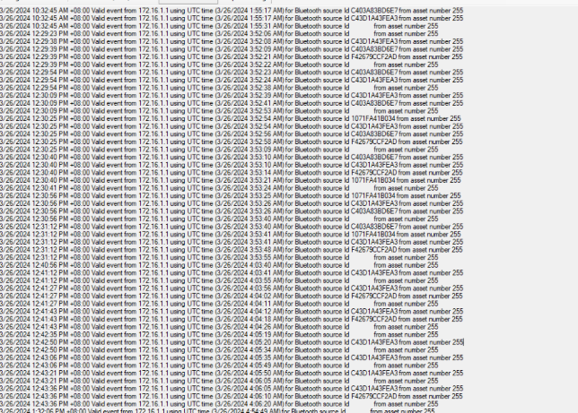
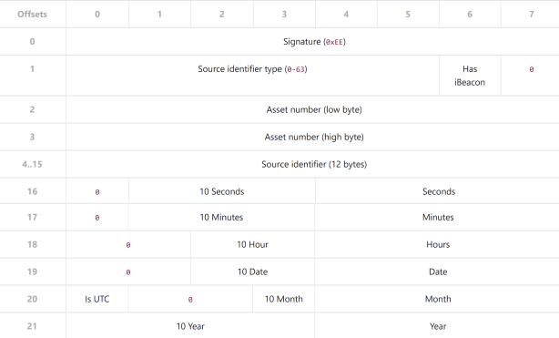
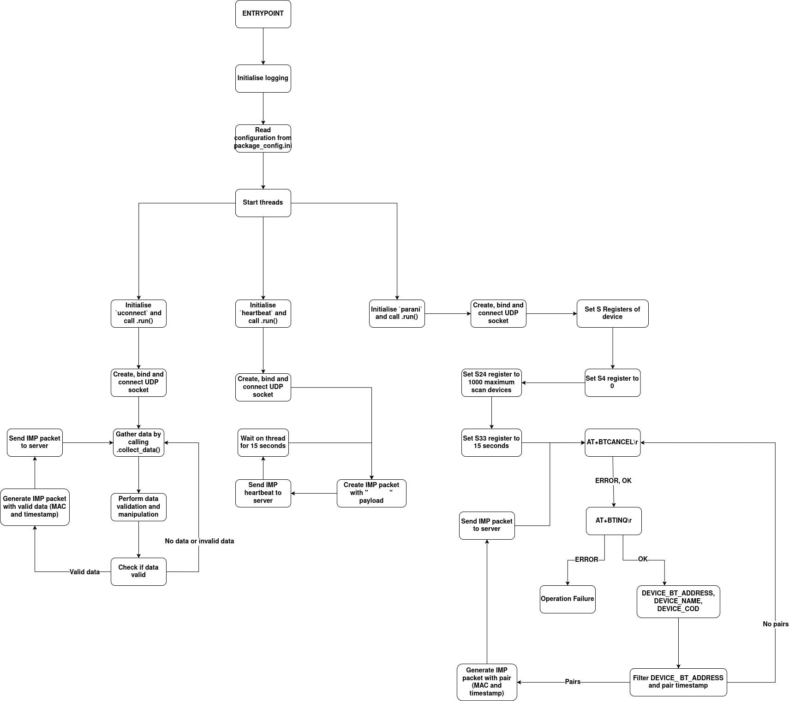
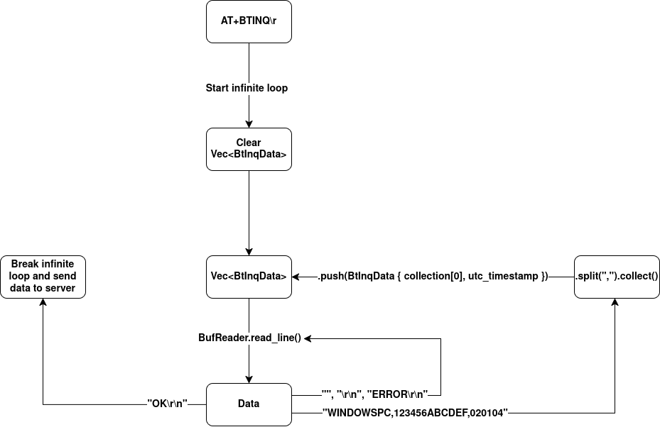

# Cisco IOx-hosted Bluetooth Scanner

### Original Python Proof-of-Concept
A [Python application](https://github.com/harthomp/parani_iox) utilising the PySerial library, AT commands are sent to the Parani SD1000 over RS232 connection. A specialised RJ45-to-DB9 adapter is required for use on the native serial port (which is DTE) of the IR1101.

This implementation successfully collected the Bluetooth MAC addresses of nearby devices via an Inquiry scan using the Parani dongle. Each recorded MAC address is paired with an accurate timestamp, given immediately after the address is detected.

After the Inquiry scan is completed (i.e. a binary “OK\r\n” is read from the serial connection at end of scan), the collected MAC address, timestamp pairs are normalised into specialised 22-byte packets (Incoming Message Protocol). These packets are then sent to the test server, a third-party application developed by AddInsight. 

### Productionised Rust Application

Whilst the Python Proof-of-Concept validated the idea of collecting MAC addresses and sending them off to the server, it was only capable of inquiring for Bluetooth 2.0 + EDR capable devices. This was sufficient for the initial design, however it leaves a large amount of modern devices off the table for data collection.

Hence, it was decided a second Bluetooth capable dongle was necessary to gather raw BLE packets, alongside any device broadcasted iBeacon packets. It was decided the UconnectS2B5232R was a suitable device.

The fundamental design in the Rust codebase differs, relying on threads to remain simple and synchronous, but remaining true to the original intentions specified in the original PoC. Furthermore, the base IR1101 only features a single Async port, thus testing and development were completed on an IR1835 with two Async ports instead.

The image below showcases an expected output seen from the test server.



# Adapter Pinouts for Parani DCE adapter
Parani DCE to IR1101 DTE

| Parani DB9 | IR1101 RJ45 | Adapter RJ45 colour |
|------------|-------------|---------------------|
| 1          | 2           | Orange              |
| 2          | 5           | Green               |
| 3          | 6           | Yellow              |
| 4          | 3           | Black               |
| 5          | 4           | Red                 |
| 6          | 1           | Blue                |
| 7          | 8           | White               |
| 8          | 7           | Brown               |
| 9          | N/A         | N/A                 |

# Network Protocols

The transmission of the Bluetooth MAC addresses and timestamp pairs require a specialised 22-byte long packet format to be crafted and packed. A pair can only be transmitted via a single packet, i.e. there are no chaining of records into a single packet. The name of this packet is the Incoming Message Protocol, its responsiblility is to structure the data for the external server-side processing.



There is also a heartbeat packet, in which the Bluetooth MAC address is set to twelve ASCII space characters. This is used in times of low traffic, as an error-checking mechanism to ensure the hardware device has not become faulty and is still functioning as expected. This is sent every 15 seconds at the start of the loop's execution.

# User Guide

### Login to router GUI


### Navigate to IOx tab and login


### Install IOx app, using same name as app-hosting config


### Set async port values in IOx app


### Configure parameters for IOx app


# Router Configuration

### Setting up IOx

The admin:cisco credentials are used when logging into the web-based GUI of IOx.

``` ios-xe
router(config)# iox
router(config)# ip http server
router(config)# ip http secure-server
router(config)# username admin privilege 15 password 0 cisco
```

### Configuring Async and line interfaces

Whilst here we manually configure the line speeds, they should be DCE in production.

``` ios-xe
router(config)# int async0/2/0
router(config-if)# encapsulation relay-line
router(config)# int async0/2/1
router(config-if)# encapsulation relay-line

router(config)# line 0/2/0
router(config-line)# speed 57600
router(config)# line 0/2/1
router(config-line)# speed 115200
```


### Relaying Async line interfaces to IOx

Tunnels two async interfaces into the IOx subsystem for usage by application.

``` ios-xe
router(config)# relay line 0/2/0 0/0/0
router(config)# relay line 0/2/1 0/0/1
```

### App Hosting

We must now pass in the two Async relayed ports into the IOx app. This was not well documented, so I can only hope open-sourcing this knowledge may help someone in their IOx development. Must use the `run-opts` docker resource command to pass in the two seperate ttySerial, instead of just relaying to 0/0/0, as specified in the [IOx serial relay service](https://www.cisco.com/c/en/us/td/docs/routers/access/IR1800/software/b-cisco-ir1800-scg/m-iox-serial-relay.html).

``` ios-xe
router(config)# int virtualportgroup 0
router(config-if)# ip address 172.16.1.1 255.255.255.0

router(config)# app-hosting appid bt_iox
router(config-app-hosting)# app-vnic gateway0 virtualportgroup 0 guest-interface 0
router(config-app-hosting-gateway0)# guest-ipaddress 172.16.1.2 netmask 255.255.255.0
router(config-app-hosting)# app-default-gateway 172.16.1.1 guest-interface 0
router(config-app-hosting)# app-resource docker
router(config-app-hosting-docker)# run-opts 1 "--device /dev/ttySerial:/dev/ttySerial"
router(config-app-hosting-docker)# run-opts 2 "--device /dev/ttySerial1:/dev/ttySerial1"
```

### Dynamic App Addressing Assignment via DHCP

``` ios-xe
router(config)# ip dhcp excluded-address 172.16.1.1
router(config)# ip dhcp pool bt_iox
router(dhcp-config)# network 172.16.1.0 255.255.255.0
router(dhcp-config)# default-router 172.16.1.1
router(dhcp-config)# domain-name router.local
router(dhcp-config)# dns-server 1.1.1.1
```

# Design of Software Functionality

A full state machine diagram of the inner workings of the software can be seen below. Excluded logging of the phases for brevity sake.



However, for the sake of readability, I simplified the Parani's filtering and data collection for the BT_INQ operation. A more detailed diagram can be seen below.



# To-do
- Some kind of set env variable for `RUST_LOG=debug` to see debug level logging.
- Using lifetimes instead of cloning the Configuration struct into threads.
- Validate configuration parameters instead of absolute .unwrap()'s inside struct constructor.
- Some kind of .is_alive() fn for ParaniSD1000 that check conn to device is still functional.
- Define appropriate read timeout period for UConnectS2B5232R.
- Thread recovery strategies, if any, or definitely needed.
- Logging to some kind of off-device OpenTelemetry Protocol (OTP) broker.
- `cargo chef` for improving Docker build/compile time (about 2.5 minutes currently).

# Resources
- [ParaniSD1000 manual](https://www.microtechnica.tv/support/manual/sd1000_man.pdf)
- [UConnectS2B5232R manual](https://uconnect.com.tw/files/BLE_V5.0_Beacon_RS-232_Reader_user_manual_V1.2_S2B5232RI.pdf)